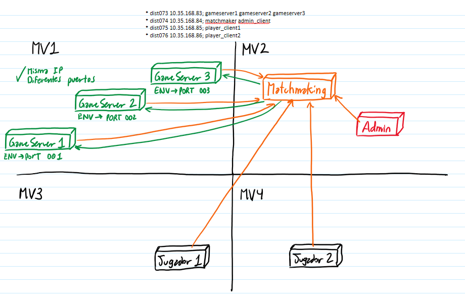

# Grupo-19

## Integrantes

* Maximiliano Sepúlveda Alvear.
* Felipe Mellado Olea.

## Construir imágenes

Para construir todas las imágenes de cada servicio se debe ejecutar el siguiente comando:

```bash
make build
```

## Ejecutar contenedores

Para ejecutar un contenedor en específico se debe ejecutar el siguiente comando:

```bash
make docker-SERVICIO
```

Donde `SERVICIO` puede ser `docker-servidores`, `docker-matchmaking`, `docker-jugador1`, `docker-jugador2` o `docker-admin`.

Ejemplo, ejecutar el contenedor de cdp:

```bash
make docker-servidores
```

## Configuración de variables de entorno

En el archivo `docker-compose.yml` se encuentran las variables de entorno necesarias para cada servicio.

* `IP`: Corresponde a la dirección IP en donde va a escuchar el servicio. Por defecto es 0.0.0.0
* `PORT`: Corresponde al puerto en donde va a escuchar el servicio

* `ID` o `SERVERID`: Corresponde al identificador del servidor, el cual debe ser único para cada servicio.

* `MATCH_IP`: Corresponde a la dirección IP del servicio de matchmaking.
* `MATCH_PORT`: Corresponde al puerto del servicio de matchmaking.

* `REAL_IP`: Corresponde a la dirección IP real del servidor de juego, que se envia al matchmaker para que los jugadores puedan conectarse.

La configuración de cada servicio es la siguiente (puesta por nosotros):

* **gamserver1**: IP=MV1, PORT=50001, SERVERID=gameserver1
* **gamserver2**: IP=MV1, PORT=50002, SERVERID=gameserver2
* **gamserver3**: IP=MV1, PORT=50003, SERVERID=gameserver3

* **matchmaker**: IP=MV2, PORT=50051

## Maquinas virtuales

Cada máquina virtual tiene una IP diferente y un contenedor diferente :

* MV1 : dist073 10.35.168.83; gameserver1 gameserver2 gameserver3
  * make docker-servidores
* MV2 : dist074 10.35.168.84; matchmaker admin
  * make docker-matchmaking
* MV3 : dist075 10.35.168.85; jugador1
  * make docker-jugador1
* MV4 : dist076 10.35.168.86; jugador2
  * make docker-jugador2

Admin se puede ejecutar en cualquier máquina virtual, pero se recomienda ejecutarlo en MV2, ya que es donde se encuentra el servicio de matchmaking y es la maquina que queda disponible para una terminal interactiva, ya que M3 y M4 tienen las terminales interactivas de los jugadores.



## Lógica del Sistema

- El sistema inicia con los servidores de juego (gameserver1, gameserver2, gameserver3) y el servicio de matchmaking corriendo en sus respectivas máquinas virtuales.
- Los jugadores (jugador1 y jugador2) se conectan al servicio de matchmaking para encontrar un juego.
- El servicio de matchmaking asigna a los jugadores a un servidor de juego disponible.
- Cuando un jugador se conecta, el servicio de matchmaking envía la IP y el puerto del servidor de juego al jugador.
- Cuando un servidor de juego se cae, el servicio admin puede reiniciar el servidor de juego caído.

## Comandos útiles

### Jugador

```bash
=======BIENVENIDO JUGADOR=======
No hay jugadores en cola.
Seleccione una acción a realizar:
1:Entrar en cola
2:Obtener estado
3:Salir de cola
4: Salir
```

Para encolarse, se debe tomar la opción 1, luego escribir el nombre del jugador y presionar enter. El jugador será encolado y se le asignará un servidor de juego.

El otro jugador puede hacer lo mismo, y el servicio de matchmaking asignará un servidor de juego disponible para ambos jugadores.

### Admin

```bash
=======BIENVENIDO ADMINISTRADOR=======
Seleccione una acción a realizar:
1:Obtener el estado de los servidores
2:Modificar el estado de un servidor
3: Salir
```

Para obtener el estado de los servidores, se debe tomar la opción 1. El servicio de matchmaking mostrará el estado de los servidores de juego y si están disponibles o no.

```bash
=====Servidor gameserver2=====
    Status: 0
    Address: 10.35.168.83:50002
    Current Match: ninguno
=====     =====
=====Servidor gameserver3=====
    Status: 0
    Address: 10.35.168.83:50003
    Current Match: ninguno
=====     =====
=====Servidor gameserver1=====
    Status: 0
    Address: 10.35.168.83:50001
    Current Match: ninguno
=====     =====
```

Para modificar el estado de un servidor, se debe tomar la opción 2. El servicio de matchmaking solicitará el ID del servidor y el nuevo estado (disponible o no disponible). Luego, el servicio de matchmaking actualizará el estado del servidor.

```bash
=====Servidor gameserver2=====
    Status: 0
    Address: 10.35.168.83:50002
    Current Match: ninguno
=====     =====
=====Servidor gameserver3=====
    Status: 2
    Address: 10.35.168.83:50003
    Current Match: ninguno
=====     =====
=====Servidor gameserver1=====
    Status: 0
    Address: 10.35.168.83:50001
    Current Match: ninguno
=====     =====
>>> gameserver3
Seleccione el nuevo estatus:
0: DISPONIBLE
1: OCUPADO
2: CAIDO
3:DESCONOCIDO
4: CANCELAR
>>> 0
```
